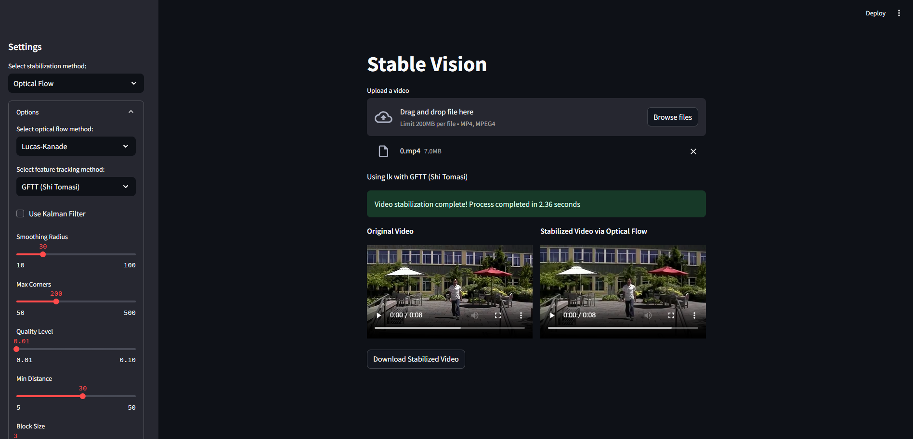

# CSL 7360 - Computer Vision Course Project  


StableVision is a video stabilization project developed as part of the CSL 7360 - Computer Vision course

## Directory Structure
```bash

StableVision/
├── src/
│   ├── app.py                     # Main Streamlit app
│   ├── classical/
│   │   ├── optical_flow/          # Optical Flow-based stabilization
│   │   ├── block_matching/        # Block Matching-based stabilization
│   │   ├── bitplane_matching/     # Bitplane Matching-based stabilization
│   │   ├── l1_optimal_paths/      # L1 Optimal Paths stabilization
│   ├── NNDVS/
│   │   ├── eval_nus.py            # Deep learning-based stabilization
│   │   ├── model/                 # PathSmoothUNet model
│   │   ├── dataset/               # Dataset utilities
│   │   ├── motion_data/           # Precomputed motion files
│   │   ├── outputs/               # Stabilized video outputs
│   ├── utils/
│       ├── codec_conversion.py    # FFmpeg utilities for codec compliance
├── requirements.txt              # Python dependencies
├── README.md        # Project documentation
```


## Methods
- **Classical Stabilization Methods**:
  - Optical Flow (Lucas-Kanade, Horn-Schunck, Farneback)
  - Block Matching
  - Bitplane Matching
  - L1 Optimal Paths
  - Meshflow
- **Deep Learning-Based Stabilization**:
  - NNDVS inference based on ICCV 2023 paper: Minimum Latency Deep Online Video Stabilization

---

## Installation

### Prerequisites
- Python 3.9
- ffmpeg, libgl1
- CUDA (optional, for GPU acceleration)

### Steps
1. Clone the repository:
   ```bash
   git clone https://github.com/your-username/StableVision.git
   cd StableVision
    
2. Create a virtual env if you wish to
3. Install required dependencies
    ```bash
    pip install -r requirements.txt

4. Ensure ffmpeg is installed


## Usage

1. Start the streamlit app 
```bash
    cd src
    streamlit run app.py
```


## Acknowledgements
This project refers the following repositories:

- [L1 Optimal Paths Stabilization](https://github.com/ishank-juneja/L1-optimal-paths-Stabilization): A classical video stabilization method based on L1 optimal paths.
- [NNDVS: Minimum Latency Deep Online Video Stabilization](https://github.com/liuzhen03/NNDVS): A deep learning-based video stabilization method using PathSmoothUNet.

